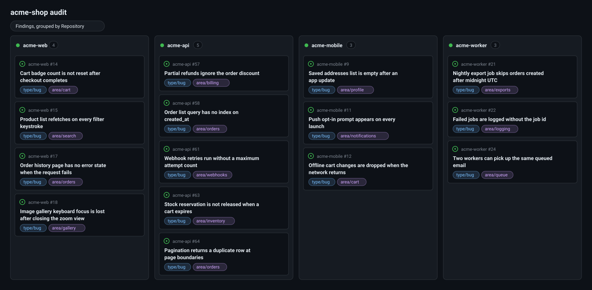
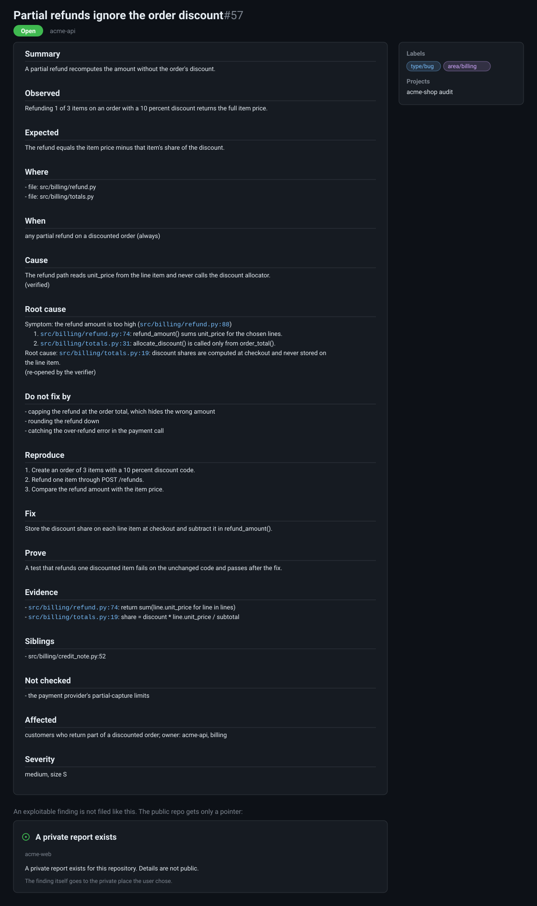

# Crucible

The skill an agent loads when asked to audit a whole system: every repo, every file, with proof that each file was read.

## How a run goes

1. **Interview.** The agent detects your repos by script, then asks its questions one at a time, each with the safest default: scope, goals, stages, tracker, whether findings may be filed automatically, advisories, other owners, privacy words, budget, models, live checks, blocker fixes, backups, permanent memory, outside knowledge sources. Each answer is recorded with `crucible answer`. You then grant or refuse each group of actions (`crucible plan`, `crucible grant`). Nothing runs until you say yes to the summary and every group has an answer.
2. **Inventory.** Each repo is cut into units of at most 90 KB of whole files.
3. **Read.** One reader agent per unit reads every file through a command that stamps what it shows.
4. **Prove.** A script checks the reader's transcript: every file shown whole, every stamp valid.
5. **Verify.** A different agent tries to prove each candidate false.
6. **Accept.** A script promotes the surviving candidates to findings and checks every field.
7. **File.** The findings go to the tracker you chose, with a "Before you fix" block, and are read back. If you did not allow automatic filing, you see the dry-run list first and `crucible approve` gives the go.
8. **Report.** `crucible report` lists every action taken, every action refused or skipped, coverage N of M and tokens spent.

Two things run beside the pipeline. A **blocker** (a missing tool, a failing command, a tracker without a field or label, a token without a scope) can be fixed with your permission: `crucible blocker`, `crucible fix`; a backup comes first and the blocked stage must pass again. Product findings are filed, never fixed. **Knowledge** from outside this machine (issues, docs sites, wikis, exports) can be fetched read-only with `crucible knowledge fetch` and absorbed into permanent memory. Backups of anything that can be lost are on by default.

## What it looks like



The data is made up. `crucible board apply` creates the Area, Stage, Severity, Priority, Size and Owner fields and the views Start here, By stage, By repo and By owner (Security too, on a private board). `crucible file --apply` then creates each issue, adds it to the board and sets those fields. The Start here view shows the first stage. The API cannot set a view's group by, so you set that on the board page.



The data is made up. `crucible file --apply` writes this body from the accepted finding; an exploitable finding gets only the pointer shown at the bottom on a public repo.

## The engine

```sh
python scripts/crucible.py selftest --replay
python scripts/crucible.py --root ./crucible-audit init --repo ./my-service
```

Python 3.10 or newer, standard library only. The GitHub adapter needs the `gh` CLI.

| Part | What it is |
| --- | --- |
| `scripts/crucible.py` | the command line |
| `scripts/cruciblelib/` | the engine |
| `scripts/test_portability.py` | proves no project-specific word entered the skill |
| `fixtures/seeded/` | a small sample system with known defects, used by the self-test |

## Layout

```
crucible/
├── SKILL.md              trigger, interview, pipeline, guarantees
├── agents/               reader and verifier briefs
├── references/
│   ├── interview.md      the questions, defaults and config keys
│   ├── permissions.md    groups, grants, action log, backups
│   ├── blockers.md       blocker fixes
│   ├── memory.md         permanent memory and knowledge flow
│   ├── method.md         the nine method rules
│   └── finding-schema.md the finding and verdict shapes
├── scripts/              engine and tests
└── fixtures/             sample system and recorded replays
```

## Installing

```bash
npx skills add NoMercyLabs/skills --skill crucible
```

Or as a Claude Code plugin: `/plugin marketplace add NoMercyLabs/skills`, then `/plugin install nomercylabs@nomercylabs`.

Grimoira, the optional permanent memory, installs with `/plugin marketplace add NoMercyLabs/skills` and then `/plugin install grimoira@nomercylabs`. If you already added NoMercyLabs/grimoira as a marketplace, keep it: it lists the same plugins. Grimoira comes from the same publisher as this skill (github.com/NoMercyLabs/grimoira). Read exactly what it changes before you say yes: https://github.com/NoMercyLabs/grimoira/blob/master/HOW-IT-WORKS.md

For a system that spans several repos, crucible detects the layout (`crucible layout`), lists the repos the code points to (`crucible related`), can read them from a fresh base folder (`crucible workspace`) and draws the edges between repos with file:line evidence (`crucible graph`).

## Design decisions

**The engine enforces the interview.** A rule in a prompt is a promise. Every command refuses to run while the config is unconfirmed.

**A script accepts, never a report.** A reader's "I read everything" is checked against stamps only the engine can make. A verifier's "this is real" is checked for quoted lines that exist.

**Coverage is a count.** "Found nothing" means nothing without N of M from the ledger.

**Every permission is asked first.** Each group of outward actions has its own yes or no, bounds the engine enforces, and a log line for every action.

**Nothing leaves the machine by default.** The tracker is the one place findings go, and the user chooses it.
